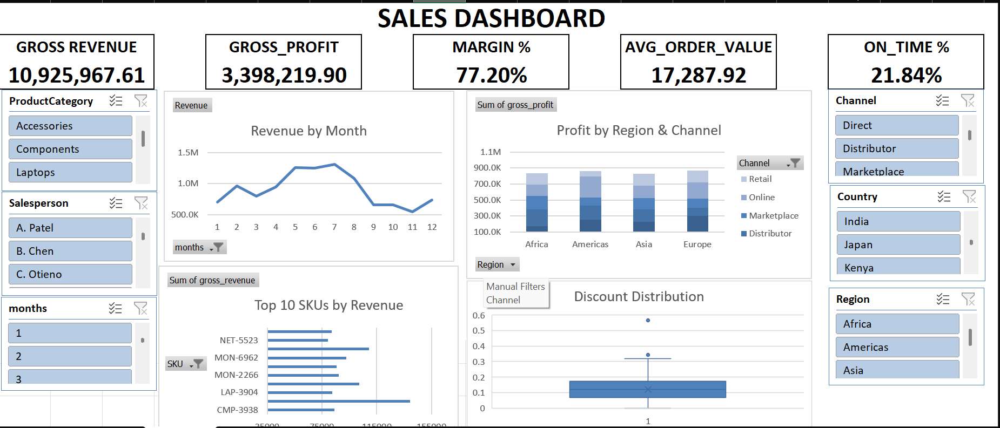

# Sales Operations & Analytics Excel Mastery

## 1. Project Overview

This workbook analyses **632 transactional sales records** from a multi-regional
electronics distributor. Starting from a raw extract with intentional data-quality
problems, the data is cleaned, enriched, analysed, and surfaced through an
interactive single-page dashboard.

All measures are driven by live Excel formulas and PivotTables there are no
hard-coded totals. Filtering the dashboard slicers recalculates every KPI, chart,
and dynamic title.

## 2. Interactive Dashboard

The primary output is a single-page interactive dashboard built for executive review. It allows for dynamic filtering of sales data to uncover regional, channel, and product-level insights.

### Key Features
- **Slicers (6):** Region, Country, Channel, ProductCategory, Month, Salesperson.
- **KPIs (5):** Total Revenue, Gross Profit, Margin %, Avg Order Value, On-Time % (≤ 7 days). All KPIs recalculate with the slicers via `GETPIVOTDATA`.
- **Visuals (4):** Revenue by Month (line), Profit by Region & Channel (stacked column), Top 10 SKUs by Revenue (bar), Discount Distribution (box & whisker).
- **Insights panel:** 8 narrative bullets covering all four regions.

## 3. Summary of Key Findings

*   **Overall Performance:** The business generated **$10.93M** in revenue at a **31.1%** gross margin ($3.40M profit). However, the on-time shipment rate is a major operational risk, with only **21.8%** of orders meeting the 7-day target.
*   **Regional Variances:** **Asia** is the largest market by revenue ($2.84M) but suffers from the lowest margin (29.3%) and worst on-time rate (17.0%). In contrast, **Africa** is the most efficient, with the best on-time rate (24.8%) and a high margin (32.2%) on a smaller order base.
*   **Channel Cannibalization:** **Online** sales are steadily replacing **Retail** sales in every region. The trend is most pronounced in the **Americas**, where Retail revenue fell 72% from 2023-2025 while Online grew, making it the dominant channel.
*   **Pricing & Compliance:** The **Americas** has a strong 32.1% margin but the highest rate of non-compliant discounts (17.2% of orders >20% discount). Pricing outliers exist across regions, with one discount reaching 56.5%, far exceeding the 30% policy cap.
*   **Product & Sales Performance:** Revenue is highly concentrated. The top **~45%** of SKUs (Class A) drive **80%** of revenue. There is also a **73%** performance gap between the top salesperson (~$20.9k revenue/order) and the bottom.

## 2. Workbook Structure (sheet guide)
| Sheet | Purpose |
|-------|---------|
| **original_data** | Untouched raw extract (632 rows × 15 columns). |
| **Brief** | The assignment specification. |
| **clean_data** | Staging table (`Table1`, 42 columns) — cleaning, enrichment, calculated fields. |
| **Quantiles** | Price-band cut-offs (33rd / 67th percentiles of UnitPrice). |
| **Cohort_analysis** | First-order cohort: revenue by Country × months-since-first-order. |
| **ABC_analysis** | SKU ABC classification by revenue within each category. |
| **sales** | Salesperson productivity metrics + monthly revenue. |
| **channelmix** | Revenue/profit by Region × Channel + cannibalisation analysis. |
| **lead_proxy** | Service-level proxy: % of orders meeting the ≤7-day target. |
| **price_compliance** | Share of orders > 20% discount by Region & Salesperson + outlier list. |
| **scenario modeling** | What-If control panel (baseline vs modelled). |
| **Dashboard** | Single-page interactive dashboard (KPIs, slicers, charts, insights). |

## 3. Part A Data Cleaning & Preparation

### 3.1 Data issues found
- **Missing values:** 8 blank `City`, 8 blank `Channel`, 8 blank `Salesperson`.
- **Out-of-policy discounts:** orders discounted above the 30% policy ceiling (max 56.5%).
- **Invalid lead times:** `RequiredDate` earlier than `OrderDate` (negative lead time).
- **Negative-margin lines:** rows where `UnitCost` exceeds `UnitPrice`.

### 3.2 Duplicate criteria
A row is treated as an exact duplicate only when **every field** matches another row
(full-record match). No full-record duplicates were present, so no rows were removed;
`short_order_id` is retained as a readable order key.

### 3.3 Cleaning rules applied
- **Missing City / Channel / Salesperson** → imputed with the **most-common (mode) value
  for that same Country**, a defensible business rule given regional sales coverage.
- **Data types** dates stored as real dates; numeric fields stored as numbers.
- **Lead time** `lead_time = RequiredDate − OrderDate`. Where negative,
  `adj_lead_time` substitutes the **median lead time**, and `adj_required_date`
  is rebuilt as `OrderDate + adj_lead_time`.
- **Discounts** `cap_adjusted_discount = MIN(DiscountPct, global cap)`;
  a `discount>30%` flag marks policy breaches.

### 3.4 Calculated columns (in clean_data)
| Field | Formula |
|-------|---------|
| `gross_revenue` | `UnitPrice × Quantity × (1 − DiscountPct)` |
| `cost_of_goods` | `UnitCost × Quantity` |
| `gross_profit`  | `gross_revenue − cost_of_goods` |
| `Margin %`      | `IF(gross_revenue = 0, 0, gross_profit / gross_revenue)` |

### 3.5 Standardised dimensions
- `MMM-YYYY` month and `Q#-YYYY` quarter derived from `OrderDate`.
- Region hierarchy: **Region → Country → City**.
- `price_band` (Low / Medium / High) from the percentile cut-offs in **Quantiles**.

## 4. Part B Analysis

- **Cohort (Cohort_analysis):** each Country's first order month is identified, and
  revenue is tracked by *months since first order*.
- **ABC (ABC_analysis):** SKUs are aggregated by revenue, ranked **descending within
  each ProductCategory**, and classified on cumulative share —
  **A ≤ 80%, B ≤ 95%, C > 95%**. Result: 284 A, 168 B, 178 C across 630 SKUs.
- **Salesperson productivity (sales):** Revenue/Order, Orders/Month, and
  GrossProfit/Order per salesperson; **top 3 highlighted green, bottom 3 red**.
- **Channel mix & cannibalisation (channelmix):** revenue and profit shares by
  Region × Channel, plus year-on-year Online vs Retail trends. *Finding:* Online is
  displacing Retail in every region, sharpest in the Americas (Retail −72%, 2023→2025).
- **Service level (lead_proxy):** % of orders meeting the **≤ 7-day** target, by
  Country and by Category.
- **Price compliance (price_compliance):** share of orders with `DiscountPct > 20%`
  by Region and Salesperson, with a sorted outlier list.

## 5. Part C Scenario Modelling (What-If)
The **scenario modeling** sheet drives three controls, referenced by `clean_data`
with locked absolute references (`$B$2/$B$3/$B$4`) so every row responds:
- **Global Discount Cap** (caps each order's discount).
- **Unit-Cost Inflation** factor.
- **Quantity Uplift** factor.

Baseline vs modelled Revenue and Profit are compared side by side. At the current
settings (10% cap, 10% cost inflation, 20% uplift), modelled revenue is **$13.79M**
vs a **$10.93M** baseline.

## 6. Part D Interactive Dashboard
- **Slicers (6):** Region, Country, Channel, ProductCategory, Month, Salesperson.
- **KPIs (5):** Total Revenue, Gross Profit, Margin %, Avg Order Value, On-Time %
  (≤ 7 days). All recalc with the slicers via `GETPIVOTDATA`.
- **Visuals (4):** Revenue by Month (line), Profit by Region & Channel (stacked
  column), Top 10 SKUs by Revenue (bar), Discount Distribution (box & whisker).

## 7. Key Assumptions
- **"Order"** = one transaction line (each row); counts and AOV are per line.
- **On-Time %** = orders with `adj_lead_time ≤ 7` ÷ total orders.
- **Margin % KPI** = the **simple average of the per-order Margin % column**
  (`AVERAGE(clean_data[Margin %])`). Note this differs from the portfolio-weighted
  margin (total profit ÷ total revenue ≈ 31.1%).
- Imputed dimension values use the **per-Country mode**.
- Negative lead times and over-cap discounts are corrected, not deleted, to preserve
  record counts.

## 8. How to Use
1. Open **Dashboard** and click any slicer to filter; KPIs and charts update live.
2. Adjust the three inputs on **scenario modeling** to test What-If scenarios.
3. Drill into the supporting sheets (ABC_analysis, price_compliance, channelmix,
   lead_proxy, Cohort_analysis) for the detailed workings behind each KPI.